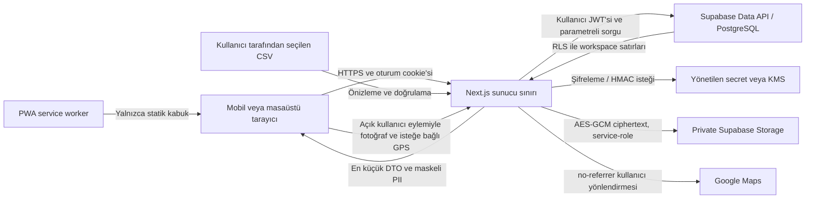

# Portföy Radar tehdit modeli

- Durum: Kabul edildi
- Sürüm: 2.6
- Tarih: 2026-07-28
- Sahip: Güvenlik ve mühendislik
- Yöntem: STRIDE ve kötüye kullanım senaryoları

## Kapsam

Model; Next.js uygulamasını, Supabase Auth/PostgreSQL sınırını, PWA service
worker'ını, CSV import/export akışını ve yönetilen secret altyapısını kapsar.
Portal taraması, dış mesajlaşma, Google/Outlook takvimi ve üçüncü taraf arama
sağlayıcıları MVP kapsamında değildir.

Bu belge güvenlik tasarım girdisidir; KVKK veya başka bir mevzuat için hukuki
görüş yerine geçmez.

## Korunan varlıklar

| Sınıf | Varlıklar | Temel güvenlik hedefi |
| --- | --- | --- |
| Çok kısıtlı | Şifreleme/HMAC anahtarları, service-role, oturum belirteçleri | Gizlilik ve kötüye kullanımın önlenmesi |
| Kısıtlı | Açık telefon/e-posta, şifreli PII, blind index | Gizlilik, bütünlük, kontrollü görüntüleme |
| Gizli | Kişi, gayrimenkul, ilan, fırsat, görüşme notu, görev, randevu, analiz | Workspace izolasyonu ve bütünlük |
| İç kullanım | Aşama geçmişi, aktivite geçmişi, audit, import kararları | Değiştirilemezlik ve inkâr edememe |
| Açık | Uygulama adı ve güvenli sistem durumu DTO'su | Kullanılabilirlik; gizli ayrıntı içermeme |

## Aktörler

- Workspace sahibi ve danışman.
- Gelecekteki görüntüleyici rolü.
- Oturumsuz ziyaretçi.
- Yanlış workspace'e erişmeye çalışan geçerli kullanıcı.
- Ele geçirilmiş tarayıcı oturumu veya cihaz.
- Kötü niyetli ya da hatalı CSV dosyası.
- Uygulama/veritabanı yöneticisi.
- İnternet saldırganı ve otomatik istek üreticisi.
- Güvenliği ihlal edilmiş bağımlılık veya CI süreci.

## Veri akışı ve güven sınırları

Güven sınırları:

1. Tarayıcı güvenilir değildir; gönderdiği kimlik, rol ve workspace değeri kabul
   edilmez.
2. Next.js sunucusu yetkilendirme ve DTO küçültme sınırıdır.
3. PostgreSQL RLS, uygulama hatasına karşı ikinci veri izolasyonu sınırıdır.
4. Secret/KMS sınırı anahtar değerlerini uygulama kodu ve veritabanından ayırır.
5. CSV ve URL kullanıcı girdisidir; güvenilmeyen veri kabul edilir.
6. Service worker kontrollü cache sınırıdır; yetkili veri bu sınıra girmez.

## STRIDE tehditleri ve kontroller

| Kimlik | Tür | Senaryo | Etki | Önleyici/tespit edici kontroller | Kalan risk |
| --- | --- | --- | --- | --- | --- |
| TM-S-01 | Kimlik sahteciliği | Çalınan veya uydurulan oturumla danışman gibi davranma | Yüksek | Supabase SSR oturumu, güvenli cookie, sunucuda güncel kullanıcı doğrulaması, oturum iptali | Ele geçirilmiş kilitsiz cihaz |
| TM-E-01 | Yetki yükseltme | Kullanıcının başka workspace kimliği göndererek veri okuması/yazması | Kritik | Sunucu üyelik/rol kontrolü, bütün iş tablolarında RLS, iki workspace negatif testleri | Yanlış yazılmış yeni politika |
| TM-E-02 | Yetki yükseltme | Service-role değerinin istemci paketine girmesi | Kritik | `server-only` modül, secret manager, `NEXT_PUBLIC` yasağı, bundle/secret taraması | CI veya yönetici hesabı ihlali |
| TM-T-01 | Veri tahrifi | İstemcinin aşamayı doğrudan değiştirip geçmiş veya sonraki işlem kuralını atlaması | Yüksek | Atomik domain RPC, DB constraint/trigger, append-only aşama geçmişi | Ayrıcalıklı DB yöneticisi |
| TM-T-02 | Veri tahrifi | Mükerrer adayların otomatik birleştirilmesiyle yanlış kişi/mülk ilişkisi | Yüksek | Beş kademeli PII'siz aday DTO'su; açık mobil karar; transaction içinde yeniden denetim ve advisory kilit; eski doğrudan komuta grant yok; append-only `duplicate_reviews`; workspace negatif testleri | Benzerlik eşiklerinden kaynaklanan yanlış pozitif/negatif adaylar |
| TM-T-03 | Veri tahrifi | CSV formülü, bozuk satır veya önizlemeden farklı dosyayla veri/istemci davranışını değiştirme | Yüksek | İki aşamalı import, UTF-8/başlık/alan doğrulaması, dosya SHA-256 bağı, 1.000 satır ve 1,5 MB sınırı, tek transaction rollback, formula injection koruması | Yeni dosya biçimleri |
| TM-R-01 | İnkâr etme | Kullanıcının aşama, PII görüntüleme veya export işlemini reddetmesi | Orta | Aktör, workspace, zaman, eylem ve request kimlikli append-only audit; owner-only görünüm | Paylaşılan kullanıcı hesabı |
| TM-I-01 | Bilgi ifşası | Telefon/e-postanın liste, log, hata veya test çıktısında görünmesi | Kritik | AES-GCM, maskeli DTO, açık görüntüleme audit'i, log redaksiyonu, güvenli Türkçe hata | Ekran görüntüsü veya omuz sörfü |
| TM-I-02 | Bilgi ifşası | Düz telefon hash'inin numara uzayı denenerek çözülmesi | Yüksek | Ayrı gizli anahtarlı HMAC blind index, anahtar rotasyonu, index'in istemciye verilmemesi | HMAC anahtarının ele geçirilmesi |
| TM-I-03 | Bilgi ifşası | Yetkili sayfa/API yanıtının CDN veya service worker cache'inde kalması | Yüksek | Yetkili yanıtlarda `no-store`, kullanıcılar arası ISR yok, yalnız sabit offline HTML/ikon allowlist'i, API ve workspace yanıtını yakalamayan PWA çalışma zamanı testi | Tarayıcı eklentileri |
| TM-I-04 | Bilgi ifşası | CSV export ile toplu PII sızıntısı | Yüksek | Yalnız owner/advisor; kişi adı yok; telefon sunucuda çözülüp yalnız maskelenir; en fazla 1.000 satır; no-store yanıt ve audit | İndirilmiş dosyanın paylaşılması; uygulama katmanı hız sınırı henüz yok |
| TM-D-01 | Hizmet engelleme | Büyük CSV veya pahalı filtre/rapor sorgusuyla kaynak tüketme | Orta | 1.000 satır ve 1,5 MB dosya sınırı; Server Action 2 MB gövde tavanı; exportta 1.000 satır; raporda en fazla 366 gün ve dönem index'leri | Tek workspace'in kendi kotasını tüketmesi; uygulama katmanı rate limit/timeout henüz yok |
| TM-S-02 | Kimlik sahteciliği | CSRF ile kullanıcının oturumunda yazma işlemi tetikleme | Yüksek | SameSite cookie, Origin doğrulaması, yalnızca POST mutasyon, framework CSRF kontrolleri | Tarayıcı/çerçeve açığı |
| TM-T-04 | Veri tahrifi | SQL/URL girdisiyle sorgu veya canonicalization davranışını bozma | Yüksek | Parametreli atomik RPC, Zod şeması, platform-host doğrulayan yerel canonicalizer, portal ağına istek yok | Yeni platform ve URL uç durumları |
| TM-E-03 | Yetki yükseltme | Güvensiz `SECURITY DEFINER` fonksiyonuyla RLS atlama | Kritik | Sabit `search_path`, en az grant, fonksiyon içi workspace kontrolü, migration güvenlik testi | Ayrıcalıklı migration hatası |
| TM-I-05 | Bilgi ifşası | Anahtar veya PII'nin kaynak kodu, Git geçmişi ya da telemetry'ye girmesi | Kritik | `.env` ignore, secret taraması, redakte loglama, anahtar rotasyon prosedürü | Geliştiricinin manuel paylaşımı |
| TM-T-05 | Veri tahrifi | Takip gereken görüşmenin görev veya sonraki işlem olmadan kısmi kaydedilmesi | Yüksek | Paylaşılan Zod doğrulaması, DB CHECK'leri, rol kontrollü atomik RPC ve rollback testi | Ayrıcalıklı DB yöneticisi |
| TM-I-06 | Bilgi ifşası | Serbest görüşme notu veya takip amacının timeline, audit ya da istemci sütun grant'i üzerinden açığa çıkması | Kritik | Alan bazlı AES-GCM amaç ayrımı, şifreli sütunlara grant yok, redakte metadata constraint'i ve DTO testi | Uygulama sunucusu veya keyring ihlali |
| TM-T-06 | Veri tahrifi | Tek fırsatı Aranmayacak yapıp aynı kişinin diğer fırsatlarından iletişime devam edilmesi | Kritik | Kişi düzeyinde tek aktif engel, bütün açık fırsatları kapatan atomik RPC, aktif engelde açık fırsat/görev yasağı ve çok fırsatlı DB testi | Aynı gerçek kişinin kullanıcı onayıyla ayrı kişi kayıtlarında tutulması |
| TM-R-02 | İnkâr etme | Kullanıcının iletişim engeli koyduğunu veya kaldırdığını reddetmesi | Yüksek | Şifreli neden, aktör/zaman, ortak request izli append-only audit ve kaldırmada eski kayıtları açmama | Paylaşılan kullanıcı hesabı |
| TM-I-07 | Bilgi ifşası | Aranmayacak veya kaldırma serbest nedeninin listede, audit metadata'sında ya da hata çıktısında görünmesi | Kritik | Ayrı AES-GCM amaçları, şifreli sütun grant yasağı, sabit aşama nedeni, redakte audit ve servis hata testleri | Uygulama sunucusu veya keyring ihlali |
| TM-D-02 | Hizmet/kötüye kullanım | Uygulamanın mesaj, arama veya portal tarama aracına dönüştürülmesi | Yüksek | Sağlayıcı/queue yok, otomatik gönderim ve scraping için mimari yokluk testi, ADR değişikliği zorunluluğu | Gelecekte kontrolsüz kapsam genişlemesi |
| TM-T-07 | Veri tahrifi | Öncelik bileşenleri veya eşitlik sırası katmanlar arasında farklı uygulanarak fırsatların sessizce yanlış sıralanması | Yüksek | Sürümlü `priority-v1` formülü PostgreSQL görünümünde tek kaynak; DTO formül doğrulaması; sabit puan ve eşitlik fixture'ları; her bileşenin Türkçe gösterimi | Formülün iş hedefleriyle zaman içinde uyumsuzlaşması |
| TM-I-08 | Bilgi ifşası | Günlük arama sırasında kişi kimliği, telefon, şifreli değer veya blind index'in açığa çıkması | Kritik | PII-siz görünüm ve açık kolon allowlist'i; korumalı ad için üyelik kontrollü varlık fonksiyonu; telefonu yalnız owner/advisor için tekil, audit'li RPC ile sunucuda çözme; bileşen ve DB negatif testleri | Yetkili kullanıcının açık telefon ekranından görüntü alması |
| TM-T-08 | Veri tahrifi | Randevunun hazırlık görevi veya fırsat planı olmadan kısmi kaydedilmesi | Yüksek | Paylaşılan tarih doğrulaması; owner/advisor kontrollü atomik RPC; görev kaynağı CHECK/FK'leri; transaction sonunda hazırlık görevini doğrulayan ertelenmiş constraint trigger; rollback testi | Ayrıcalıklı yöneticinin bütün kontrolleri bilinçli kapatması |
| TM-I-09 | Bilgi ifşası | Uygulama içi takvimin başka workspace randevusunu veya kişi bilgisini göstermesi | Kritik | RLS/FORCE randevu tablosu; `security_invoker`/`security_barrier` takvim görünümü; merkezi iletişim uygunluğu; PII-siz kolon allowlist'i; iki-workspace negatif testi | Yeni takvim alanının allowlist güncellenmeden eklenmesi |
| TM-T-09 | Veri tahrifi | Pazar analizinin üç görevden biri olmadan veya emsalin farklı işlem/para birimiyle kısmi kaydedilmesi | Yüksek | Owner/advisor kontrollü atomik RPC; görev kaynak CHECK/FK'leri; üç görevi commit anında denetleyen ertelenmiş trigger; analiz bağlamını emsale bileşik FK ile miras verme; exact `numeric` hesap ve rollback testleri | Ayrıcalıklı yöneticinin kontrolleri bilinçli kapatması |
| TM-I-10 | Bilgi ifşası | Analiz/emsal görünümünün başka workspace verisini, kişi bilgisini veya serbest metni açığa çıkarması | Kritik | RLS/FORCE analiz ve emsal tabloları; `security_invoker`/`security_barrier` PII-siz görünüm; açık kolon allowlist'i; iki-workspace ve güvenli hata negatif testleri | Yeni analiz alanının allowlist güncellenmeden eklenmesi |
| TM-I-11 | Bilgi ifşası | Performans raporunun başka workspace toplamlarını veya düşük seviyeli kişi/veri ayrıntılarını açığa çıkarması | Kritik | Sunucu oturum/üyelik kontrolü; `security invoker` aggregate RPC; kaynak RLS'leri; PII-siz sabit dönüş sözleşmesi; iki-workspace, viewer ve DTO negatif testleri; dinamik/no-store sayfa | Çok küçük toplamların iş bağlamında dolaylı çıkarıma izin vermesi |
| TM-T-10 | Veri tahrifi | CI veya release politikasının değiştirilerek test/kanıt kapılarının atlanması | Kritik | Salt okunur workflow token'ı, kilitli bağımlılık kurulumu, `pull_request_target` yasağı, statik kapı bütünlük testi, manuel canlı PII assertion'ı ve Git geçmişinde kanıt referansı | Repository yöneticisinin korumalı dal/CI ayarlarını birlikte kötüye kullanması |
| TM-I-12 | Bilgi ifşası | Release durumu veya CI çıktısının secret, kişi ya da kanıt içeriği sızdırması | Yüksek | Owner-only `private, no-store` DTO; sabit alan allowlist'i; yalnız kapı kimliği/sorumlu rolü; test çıktısında PII/secret taraması | Üçüncü taraf GitHub Action veya ele geçirilmiş runner |
| TM-D-03 | Hizmet engelleme | Piksel bombası veya aşırı büyük görselin bellek/CPU tüketmesi | Yüksek | İstemci küçültme; sunucuda imza/MIME/12 MiB giriş/25 MP piksel sınırı; `sharp` fail-on-error ve 1,5 MiB çıktı tavanı | Görsel codec açığı |
| TM-I-13 | Bilgi ifşası | EXIF veya fotoğraf içeriğinin public URL, cache, log ya da yanlış bucket üzerinden açılması | Kritik | Sunucuda yeniden JPEG kodlama; ayrı medya AES-GCM keyring'i; private bucket; service-role-only Storage; signed URL yok; audit'li `private, no-store` uygulama route'u | Yetkili kullanıcının ekran görüntüsü |
| TM-I-14 | Bilgi ifşası | Kesin koordinatın DTO, audit, log veya arka plan üçüncü taraf isteğinde görünmesi | Kritik | Amaç ayrımlı şifreli JSON; açık koordinat kolonu yok; DTO yalnız `hasLocation`/doğruluk; Google'a yalnız açık kullanıcı eyleminde `no-referrer` redirect | Google Maps açıldıktan sonraki üçüncü taraf işleme |
| TM-T-11 | Veri tahrifi | Storage nesnesi silinmeden DB kaydının imha edilmesi veya orphan ciphertext kalması | Yüksek | Atomik cleanup claim; önce Storage API remove; sonra DB delete; başarısızlıkta claim release; 24 saat pending temizliği; idempotent cron | Cron'un uzun süre çalışmaması |
| TM-I-15 | Bilgi ifşası | Public repoda şifresiz DB/Storage yedeği veya private age identity bulunması | Kritik | Yalnız age ciphertext artifact; 30 gün retention; private identity GitHub dışında; manifest hash; loglarda secret/veri yok | age private identity kaybı veya ele geçirilmesi |

## Güvenlik gereksinimleri

- Kimlik doğrulama her istekte güncel sunucu oturumuna dayanır.
- Yetkilendirme kullanıcı girdisindeki workspace veya role güvenmez.
- RLS ve server DAL birlikte uygulanır; biri diğerinin yerine geçmez.
- Mutasyonlar idempotency ihtiyacına göre tasarlanır ve kritik çoklu yazımlar
  transaction içinde çalışır.
- Kişisel veri varsayılan olarak maskeli, en az alanlı ve `no-store` DTO'dur.
- Loglar ham PII, oturum, anahtar, blind index veya CSV satırı içermez.
- Audit log normal roller tarafından güncellenemez/silinemez ve ham PII tutmaz.
- Upload içerikleri dosya adı, MIME, boyut ve satır sayısıyla doğrulanır.
- Bağımlılıklar kilit dosyasıyla sabitlenir; kalite kapısı lint, tip, test ve
  üretim derlemesini içerir.
- Release CI token'ı yalnız kaynak okur; teknik kapı temiz migration, PostgreSQL
  lint, pgTAP/RLS, üretim bağımlılığı audit'i ve yasaklı kabiliyet taramasını
  zorunlu tutar.

## Kötüye kullanım senaryoları

1. Danışman yanlışlıkla kişiyi `Aranmayacak` yapar: işlem audit edilir, engel
   açıkça kaldırılabilir; eski fırsatlar otomatik açılmaz.
2. Kullanıcı farklı kişilere ait aynı telefonu görür: sistem birleştirmez, aday
   nedenini gösterir ve karar ister.
3. Import dosyası çok sayıda benzer ilan içerir: dosya içi olası mükerrerler
   reddedilir; veritabanı adayları satır bazında gösterilir ve açık karar
   olmadan bütün transaction durur.
4. Saldırgan API'ye başka workspace UUID'si yollar: DAL ve RLS birlikte reddeder.
5. Kullanıcı açık PII'yi görüntüler: yalnızca yetkili detay/kokpit bağlamında
   çözülür ve audit olayı yazılır.

## Yayın engelleri ve kalan riskler

| Risk veya karar | Geçici durum | Kapatma ölçütü | Sahip |
| --- | --- | --- | --- |
| Supabase Auth, workspace RLS ve MVP alan tabloları hazır | Teknik release kapısı migration/test eşleşmesini, temiz şema kurulumunu, PostgreSQL lint'i, pgTAP/RLS'yi ve uygulama DAL testlerini çalıştırıyor | Her yeni iş tablosunda migration + pgTAP + DAL + iki-workspace negatif testleri başarılı | Mühendislik |
| Şifreleme/KMS: üretim secret manager ve sürümlü keyring rotasyonu kanıtlandı | Production-only hassas değişkenler, modern Supabase anahtarları, ayrı PII/HMAC/medya keyring'leri ve geri dönüş kopyası kullanılıyor; legacy API/JWT anahtarları iptal edildi | [Production secret manager ve rotasyon kanıtı](./evidence/2026-07-28-production-secret-manager-rotation.md); olay sonrası veya en geç 90 günde yeniden denetim | Güvenlik |
| Üretim bölgesi ve KVKK metinleri onaysız | [Sentetik-only Production kararı](./evidence/2026-07-28-synthetic-production-decision.md) yürürlükte; Vercel Hobby ve yurtdışı Supabase ortamına gerçek kişi verisi girilmiyor | Uygun yurtdışı aktarım güvencesi veya Türkiye içi barındırma ile veri envanteri, aydınlatma ve saklama/imha politikası onaylanmış | Ürün sahibi |
| Yedekten dönüş tatbikatı kanıtlandı | [Production yedekleme ve geri yükleme kanıtı](./evidence/2026-07-28-production-backup-restore-drill.md): günlük workflow, 30 gün ciphertext saklama, ağsız PostgreSQL 17.6 restore ve 37 metrikte sıfır fark | En az üç ayda bir restore tatbikatı; ilk non-empty Storage nesnesi `sensitive-media-location` kapsamında ayrıca doğrulanır | Operasyon |
| Hassas medya ve kesin konum kanıtı onaysız | [Yerel sentetik tatbikatta](./evidence/2026-07-28-sensitive-media-location-local-drill.md) EXIF/şifreleme, kesin konum, yetki, no-store/no-referrer, imha ve non-empty Storage geri yükleme başarılı; `FIELD_OBSERVATION_MODE` Production'da `disabled` | Fiziksel iPhone ve Android kamera, GPS ve Google Maps cihaz kabul kanıtları başarılı | Güvenlik |
| Ele geçirilmiş danışman cihazı | Teknik olarak tamamen önlenemez | Ekran kilidi, oturum iptali ve MFA yol haritası | Ürün sahibi |

Üretim bölgesi/KVKK ve hassas medya/kesin konum satırları kapanmadan canlı
kişisel veriyle üretim yayını yapılmaz.

Teknik ilk satır CI'da her değişiklikte yeniden doğrulanır. Dört manuel
`release-v2` kapısından `secret-manager` ve `backup-restore` kanıtla
kapatılmıştır; kalan iki kapı kanıt referansı olmadan onaylanamaz. Eksik veya
bozuk politika canlı PII assertion'ını başarısız kılar.

## Doğrulama ve bakım

- [İzlenebilirlik matrisi](../product/requirements-traceability.md) değişmez iş
  kurallarını test seviyelerine bağlar.
- Tehdit modeli; yeni veri alanı, dış entegrasyon, rol, import biçimi, PWA cache
  davranışı veya anahtar yönetimi değiştiğinde aynı pull request içinde
  güncellenir.
- En az her büyük sürüm ve güvenlik olayı sonrasında yeniden gözden geçirilir.
- Yönetişim testi ADR durumlarını, 12 kuralı, STRIDE kapsamını ve yayın engeli
  sahiplerini otomatik kontrol eder.
- Owner release görünümü ve API'si yalnız redakte teknik durum, kapı kimliği,
  sorumlu rolü ve kanıt referansını döndürür; kanıt içeriği, kullanıcı, workspace
  veya secret taşımaz.
