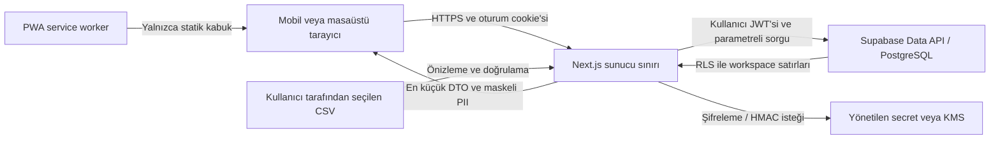

# Portföy Radar tehdit modeli

- Durum: Kabul edildi
- Sürüm: 1.1
- Tarih: 2026-07-26
- Sahip: Güvenlik ve mühendislik
- Yöntem: STRIDE ve kötüye kullanım senaryoları

## Kapsam

Model; Next.js uygulamasını, Supabase Auth/PostgreSQL sınırını, PWA service
worker'ını, CSV import/export akışını ve yönetilen secret altyapısını kapsar.
Portal taraması, dış mesajlaşma, Google/Outlook takvimi ve üçüncü taraf arama
sağlayıcıları MVP kapsamında değildir.

Bu belge güvenlik tasarım girdisidir; KVKK veya başka bir mevzuat için hukuki
görüş yerine geçmez.

## Korunan varlıklar

| Sınıf | Varlıklar | Temel güvenlik hedefi |
| --- | --- | --- |
| Çok kısıtlı | Şifreleme/HMAC anahtarları, service-role, oturum belirteçleri | Gizlilik ve kötüye kullanımın önlenmesi |
| Kısıtlı | Açık telefon/e-posta, şifreli PII, blind index | Gizlilik, bütünlük, kontrollü görüntüleme |
| Gizli | Kişi, gayrimenkul, ilan, fırsat, görüşme notu, görev, analiz | Workspace izolasyonu ve bütünlük |
| İç kullanım | Aşama geçmişi, aktivite geçmişi, audit, import kararları | Değiştirilemezlik ve inkâr edememe |
| Açık | Uygulama adı ve güvenli sistem durumu DTO'su | Kullanılabilirlik; gizli ayrıntı içermeme |

## Aktörler

- Workspace sahibi ve danışman.
- Gelecekteki görüntüleyici rolü.
- Oturumsuz ziyaretçi.
- Yanlış workspace'e erişmeye çalışan geçerli kullanıcı.
- Ele geçirilmiş tarayıcı oturumu veya cihaz.
- Kötü niyetli ya da hatalı CSV dosyası.
- Uygulama/veritabanı yöneticisi.
- İnternet saldırganı ve otomatik istek üreticisi.
- Güvenliği ihlal edilmiş bağımlılık veya CI süreci.

## Veri akışı ve güven sınırları

Güven sınırları:

1. Tarayıcı güvenilir değildir; gönderdiği kimlik, rol ve workspace değeri kabul
   edilmez.
2. Next.js sunucusu yetkilendirme ve DTO küçültme sınırıdır.
3. PostgreSQL RLS, uygulama hatasına karşı ikinci veri izolasyonu sınırıdır.
4. Secret/KMS sınırı anahtar değerlerini uygulama kodu ve veritabanından ayırır.
5. CSV ve URL kullanıcı girdisidir; güvenilmeyen veri kabul edilir.
6. Service worker kontrollü cache sınırıdır; yetkili veri bu sınıra girmez.

## STRIDE tehditleri ve kontroller

| Kimlik | Tür | Senaryo | Etki | Önleyici/tespit edici kontroller | Kalan risk |
| --- | --- | --- | --- | --- | --- |
| TM-S-01 | Kimlik sahteciliği | Çalınan veya uydurulan oturumla danışman gibi davranma | Yüksek | Supabase SSR oturumu, güvenli cookie, sunucuda güncel kullanıcı doğrulaması, oturum iptali | Ele geçirilmiş kilitsiz cihaz |
| TM-E-01 | Yetki yükseltme | Kullanıcının başka workspace kimliği göndererek veri okuması/yazması | Kritik | Sunucu üyelik/rol kontrolü, bütün iş tablolarında RLS, iki workspace negatif testleri | Yanlış yazılmış yeni politika |
| TM-E-02 | Yetki yükseltme | Service-role değerinin istemci paketine girmesi | Kritik | `server-only` modül, secret manager, `NEXT_PUBLIC` yasağı, bundle/secret taraması | CI veya yönetici hesabı ihlali |
| TM-T-01 | Veri tahrifi | İstemcinin aşamayı doğrudan değiştirip geçmiş veya sonraki işlem kuralını atlaması | Yüksek | Atomik domain RPC, DB constraint/trigger, append-only aşama geçmişi | Ayrıcalıklı DB yöneticisi |
| TM-T-02 | Veri tahrifi | Mükerrer adayların otomatik birleştirilmesiyle yanlış kişi/mülk ilişkisi | Yüksek | Yalnızca aday üretimi, açık kullanıcı kararı, `duplicate_reviews`, birleşme yokluğu testi | Hatalı kullanıcı kararı |
| TM-T-03 | Veri tahrifi | CSV formülü veya bozuk satırla veri/istemci davranışını değiştirme | Yüksek | İki aşamalı import, Zod/DB doğrulaması, 1.000 satır sınırı, formula injection koruması | Yeni dosya biçimleri |
| TM-R-01 | İnkâr etme | Kullanıcının aşama, PII görüntüleme veya export işlemini reddetmesi | Orta | Aktör, workspace, zaman, eylem ve request kimlikli append-only audit | Paylaşılan kullanıcı hesabı |
| TM-I-01 | Bilgi ifşası | Telefon/e-postanın liste, log, hata veya test çıktısında görünmesi | Kritik | AES-GCM, maskeli DTO, açık görüntüleme audit'i, log redaksiyonu, güvenli Türkçe hata | Ekran görüntüsü veya omuz sörfü |
| TM-I-02 | Bilgi ifşası | Düz telefon hash'inin numara uzayı denenerek çözülmesi | Yüksek | Ayrı gizli anahtarlı HMAC blind index, anahtar rotasyonu, index'in istemciye verilmemesi | HMAC anahtarının ele geçirilmesi |
| TM-I-03 | Bilgi ifşası | Yetkili sayfa/API yanıtının CDN veya service worker cache'inde kalması | Yüksek | Yetkili yanıtlarda `no-store`, kullanıcılar arası ISR yok, statik-kabuk-only PWA testi | Tarayıcı eklentileri |
| TM-I-04 | Bilgi ifşası | CSV export ile toplu PII sızıntısı | Yüksek | MVP'de yalnızca maskeli export, workspace yetkisi, audit ve indirme hız sınırı | İndirilmiş dosyanın paylaşılması |
| TM-D-01 | Hizmet engelleme | Büyük CSV veya pahalı filtre/rapor sorgusuyla kaynak tüketme | Orta | 1.000 satır sınırı, dosya boyutu sınırı, sorgu index'leri, timeout ve rate limit | Tek workspace'in kendi kotasını tüketmesi |
| TM-S-02 | Kimlik sahteciliği | CSRF ile kullanıcının oturumunda yazma işlemi tetikleme | Yüksek | SameSite cookie, Origin doğrulaması, yalnızca POST mutasyon, framework CSRF kontrolleri | Tarayıcı/çerçeve açığı |
| TM-T-04 | Veri tahrifi | SQL/URL girdisiyle sorgu veya canonicalization davranışını bozma | Yüksek | Parametreli sorgu, Zod şeması, URL allowlist/canonicalizer, portal ağına istek yok | Canonicalizer uç durumları |
| TM-E-03 | Yetki yükseltme | Güvensiz `SECURITY DEFINER` fonksiyonuyla RLS atlama | Kritik | Sabit `search_path`, en az grant, fonksiyon içi workspace kontrolü, migration güvenlik testi | Ayrıcalıklı migration hatası |
| TM-I-05 | Bilgi ifşası | Anahtar veya PII'nin kaynak kodu, Git geçmişi ya da telemetry'ye girmesi | Kritik | `.env` ignore, secret taraması, redakte loglama, anahtar rotasyon prosedürü | Geliştiricinin manuel paylaşımı |
| TM-D-02 | Hizmet/kötüye kullanım | Uygulamanın mesaj, arama veya portal tarama aracına dönüştürülmesi | Yüksek | Sağlayıcı/queue yok, otomatik gönderim ve scraping için mimari yokluk testi, ADR değişikliği zorunluluğu | Gelecekte kontrolsüz kapsam genişlemesi |

## Güvenlik gereksinimleri

- Kimlik doğrulama her istekte güncel sunucu oturumuna dayanır.
- Yetkilendirme kullanıcı girdisindeki workspace veya role güvenmez.
- RLS ve server DAL birlikte uygulanır; biri diğerinin yerine geçmez.
- Mutasyonlar idempotency ihtiyacına göre tasarlanır ve kritik çoklu yazımlar
  transaction içinde çalışır.
- Kişisel veri varsayılan olarak maskeli, en az alanlı ve `no-store` DTO'dur.
- Loglar ham PII, oturum, anahtar, blind index veya CSV satırı içermez.
- Audit log normal roller tarafından güncellenemez/silinemez ve ham PII tutmaz.
- Upload içerikleri dosya adı, MIME, boyut ve satır sayısıyla doğrulanır.
- Bağımlılıklar kilit dosyasıyla sabitlenir; kalite kapısı lint, tip, test ve
  üretim derlemesini içerir.

## Kötüye kullanım senaryoları

1. Danışman yanlışlıkla kişiyi `Aranmayacak` yapar: işlem audit edilir, engel
   açıkça kaldırılabilir; eski fırsatlar otomatik açılmaz.
2. Kullanıcı farklı kişilere ait aynı telefonu görür: sistem birleştirmez, aday
   nedenini gösterir ve karar ister.
3. Import dosyası çok sayıda benzer ilan içerir: önizleme her satırın adaylarını
   gösterir; toplu otomatik merge yapılmaz.
4. Saldırgan API'ye başka workspace UUID'si yollar: DAL ve RLS birlikte reddeder.
5. Kullanıcı açık PII'yi görüntüler: yalnızca yetkili detay/kokpit bağlamında
   çözülür ve audit olayı yazılır.

## Yayın engelleri ve kalan riskler

| Risk veya karar | Geçici durum | Kapatma ölçütü | Sahip |
| --- | --- | --- | --- |
| Supabase Auth, workspace RLS ve ilk kişi–gayrimenkul–ilan tabloları hazır; kalan alan tabloları henüz yok | Altı tablo RLS/FORCE, bileşik workspace FK ve iki-kiracılı negatif testlerle korunuyor; doğrudan istemci yazması kapalı | Her yeni iş tablosunda DAL, RLS ve iki-workspace negatif testleri başarılı | Mühendislik |
| Şifreleme/KMS sağlayıcısı henüz bağlanmadı | PII depolanmıyor | Rotasyon ve round-trip testleri başarılı | Güvenlik |
| Üretim bölgesi ve KVKK metinleri onaysız | Sadece geliştirme verisi | Ürün sahibi/hukuk onayı kaydedilmiş | Ürün sahibi |
| Yedekten dönüş tatbikatı yapılmadı | Kalıcı üretim verisi yok | Başarılı geri dönüş raporu | Operasyon |
| Ele geçirilmiş danışman cihazı | Teknik olarak tamamen önlenemez | Ekran kilidi, oturum iptali ve MFA yol haritası | Ürün sahibi |

İlk dört satır kapanmadan canlı kişisel veriyle üretim yayını yapılmaz.

## Doğrulama ve bakım

- [İzlenebilirlik matrisi](../product/requirements-traceability.md) değişmez iş
  kurallarını test seviyelerine bağlar.
- Tehdit modeli; yeni veri alanı, dış entegrasyon, rol, import biçimi, PWA cache
  davranışı veya anahtar yönetimi değiştiğinde aynı pull request içinde
  güncellenir.
- En az her büyük sürüm ve güvenlik olayı sonrasında yeniden gözden geçirilir.
- Yönetişim testi ADR durumlarını, 12 kuralı, STRIDE kapsamını ve yayın engeli
  sahiplerini otomatik kontrol eder.
